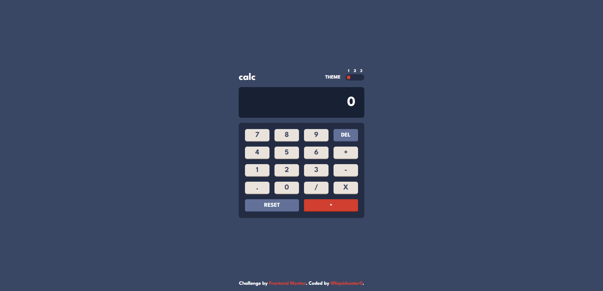

# Frontend Mentor - Calculator app solution

This is a solution to the [Calculator app challenge on Frontend Mentor](https://www.frontendmentor.io/challenges/calculator-app-9lteq5N29). Frontend Mentor challenges help you improve your coding skills by building realistic projects. 

## Table of contents

- [Overview](#overview)
  - [The challenge](#the-challenge)
  - [Screenshot](#screenshot)
  - [Links](#links)
- [My process](#my-process)
  - [Built with](#built-with)
  - [What I learned](#what-i-learned)
  - [Continued development](#continued-development)
  - [Useful resources](#useful-resources)
- [Author](#author)

## Overview

### The challenge

Users should be able to:

- See the size of the elements adjust based on their device's screen size
- Perform mathmatical operations like addition, subtraction, multiplication, and division
- Adjust the color theme based on their preference
- **Bonus**: Have their initial theme preference checked using `prefers-color-scheme` and have any additional changes saved in the browser

### Screenshot



### Links

- Solution URL: [https://www.frontendmentor.io/solutions/calculator-app-built-with-html-scss-reactjs-and-typescript-kkz5UlZSD0](https://www.frontendmentor.io/solutions/calculator-app-built-with-html-scss-reactjs-and-typescript-kkz5UlZSD0)
- Live Site URL: [https://liquidwater0.github.io/calculator-app/](https://liquidwater0.github.io/calculator-app/)

## My process

### Built with

- Semantic HTML5 markup
- CSS custom properties
- Flexbox
- CSS Grid
- [React](https://reactjs.org/) - JS library
- [Sass](https://sass-lang.com/) - CSS preprocessor

### What I learned

I am proud of this custom switch component I made. To take things even further, I decided to make it so you can provide it as many steps as you want and have a function you can call to get back the current step.
The complexity of it was not necessary for this project, but it was nice to make something more advanced. Was my first time using useImperativeHandle to make a function to cycle the steps/modes.

```js
<StepSwitch
  ref={themeSwitchRef}
  steps={3}
  defaultStep={+theme}
  onUpdate={currentStep => setTheme(currentStep.toString())}
/>
```

### Continued development

I want to continue focusing on improving my CSS skills and accessibility skills.

### Useful resources

- [MDN Web Docs](https://developer.mozilla.org/en-US/) - This site was helpful to see how to use a certain thing, I used it to see how the Intl.NumberFormat worked.

## Author

- Frontend Mentor - [@liquidwater0](https://www.frontendmentor.io/profile/liquidwater0)